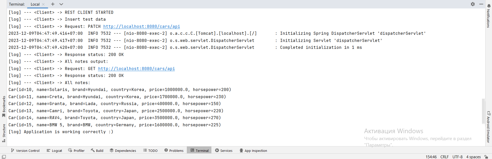
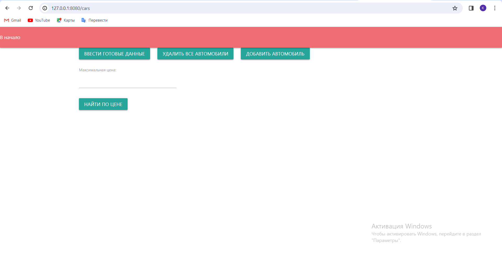
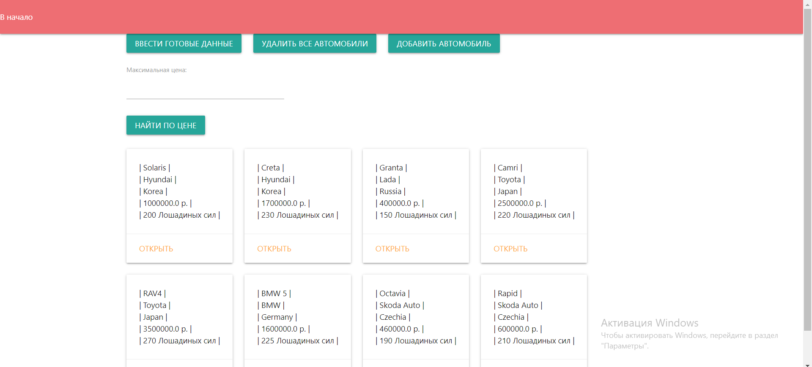
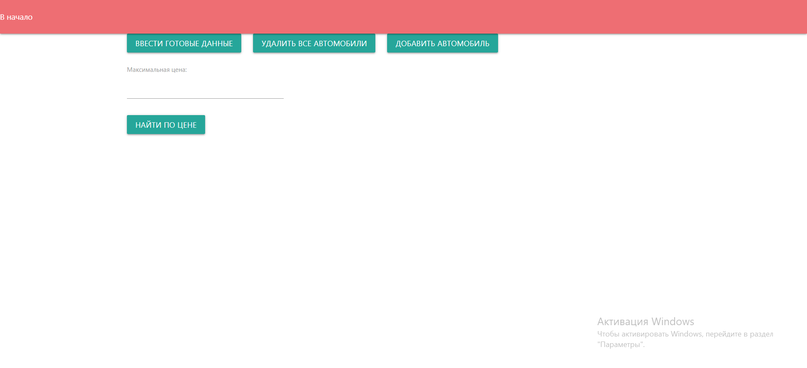
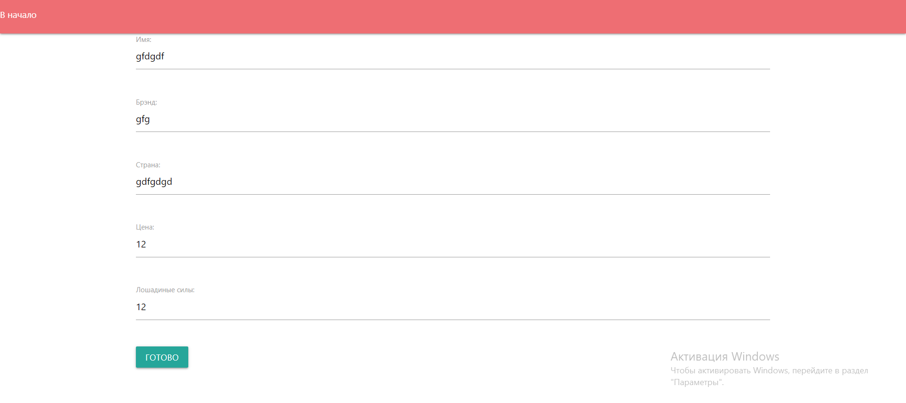
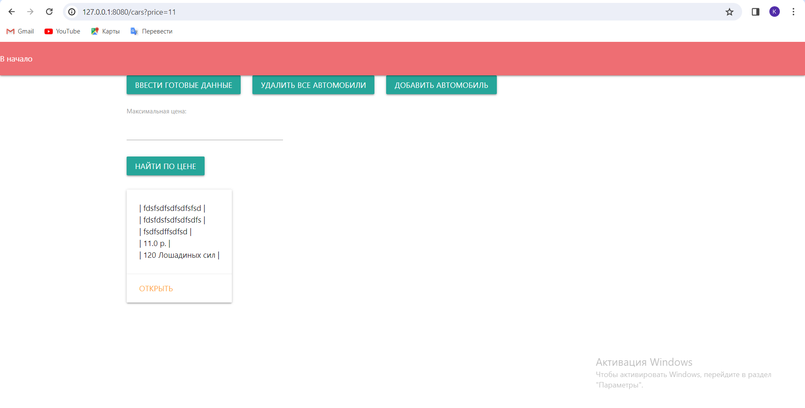
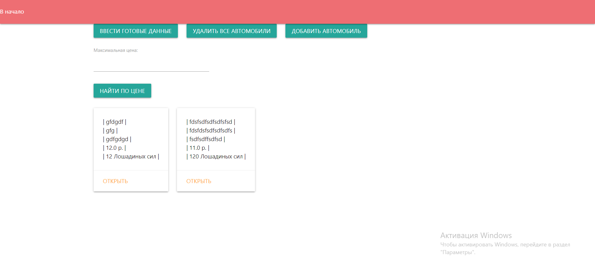
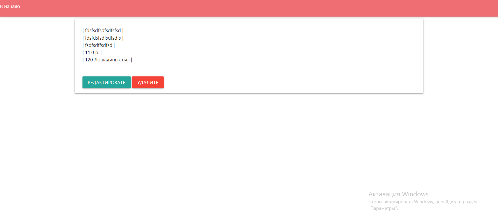
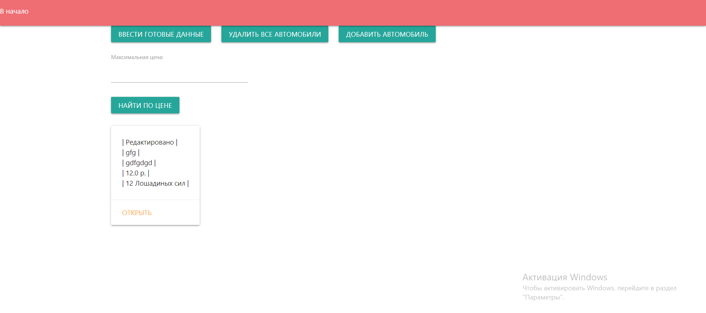

Борисюк Кирилл Алексеевич КИ21-16/2б
РКИС Лабораторная работа №7
Вариант-3


Инструкция запуска из консоли.

Скачайте проект или выполните команду:
```
git clone https://github.com/Querang/RKIS7.git
```

В консоли перейти в папку с проектом, после:
1) Создание базы данных
```
psql -U postgres -h localhost -f car_db.sql  
```
2) Собрать проект при помощи команды:
```
.\mvnw.cmd package
```
3) Запустить программу:
```
java -jar target/RKIS7-0.0.1-SNAPSHOT.jar 
```
4) Открывать [страницу localhost](http://127.0.0.1:8080)

Для использования функций админа необходимо создать пользователя с именем admin. Пользователи с другими именами будут обычными пользователями.

Для сборки необходим Maven - https://maven.apache.org/download.cgi


### Вариант 3: Автомобиль
В ходе работы были реализованы все CRUD операции. Тестовые запросы выполняются автоматически, подтверждая работоспособность программы, после чего можно перейти к работе с ПО.
\
_Тестовые запросы_

### Примеры использования ПО:
\
_Начальный экран_


\
_После нажатия кнопки "ввести готовые данные"_


\
_После нажатия кнопки удалить все автомобили_


\
_Интерфейс меню добавления_


\
_Пример фильтрации по цене_


\
_Страница с двумя автомобилями до изменений_


\
_Меню редактирования отдельного автомобиля_


\
_После удаления и редактирования автомобилей_
